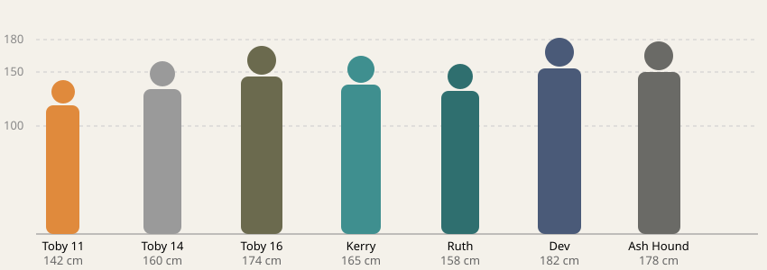

# Character visual bible

How every person, animal and recurring thing in Holdout looks, so the same
person looks the same in every comic, card and scene. Labels are explained in
[README.md](README.md#status-labels).

**Status (2026-10-10)**. Toby's people are **[Approved in use]**: their
looks are in the published comic and cards, and later art must match them.
Everyone added for Ruth's, Mags's, Dev's and Helen's stories is
**[Proposed]** and not drawn yet. Add anyone else here before drawing them.
Missing references are listed at the end ([Missing references](#missing-references)).

- **The words**: each design's exact prompt text is in
  [`scripts/visual-bible.ts`](../../scripts/visual-bible.ts) and is used word
  for word in every image prompt. Change this page and that file together.
- **The pictures**: reference sheets in [visual-bible/](visual-bible/),
  generated by [`scripts/generate-character-refs.ts`](../../scripts/generate-character-refs.ts).
- **Style for everything**: digital painting with visible brushwork, natural
  proportions, muted earthy palette, soft directional light; the look of the
  shelter scene and the sign-in painting. Never cartoon, chibi or 3D render.
  No lettering in art; words are HTML over it.
- **Comic panels** are asked for as "a painterly realistic digital painting
  like a film still" (`scripts/generate-comic-panels.ts`). "Graphic novel"
  produced cartoon line art every time, so it isn't used.

## How consistency is kept (and the limit)

The course image service accepts only a text prompt, a size and a count. On
2026-10-10 two requests carrying a reference image (`image_prompt` on
flux-1.1-pro, `character_reference_image` on ideogram-v3-quality) both
generated normally, which shows the reference was dropped. So reference
sheets **can't be fed to the generator**. Consistency comes from:

1. **One sheet per person.** All views of a person in one image, so the
   model keeps one face within it.
2. **Fixed descriptions.** Every prompt uses the person's exact description
   from `scripts/visual-bible.ts`, and names each identifiable person in a
   group scene with their own description.
3. **Compositing where a pose allows.** A figure cut from an approved sheet
   (painted on flat grey for that reason) can be placed into a generated
   background instead of being generated again.
4. **Checking every panel** against the sheets before it's accepted;
   anything that drifts is regenerated.

If the course enables image inputs, step 1's sheets are ready to pass in
directly.

## Heights

| Who | Height | Build |
|---|---|---|
| Toby at 11 | 142 cm | small, thin |
| Toby at 14 | 160 cm | lanky |
| Toby at 16 | 174 cm | lean |
| Kerry Wren | 165 cm | slight |
| Ruth Lane | 158 cm | short, sturdy, broad-shouldered |
| Dev Pillai | 182 cm | tall, lean |
| Ash Hounds | 165–185 cm | varied, bulked by coats |

## People

### Toby Wren

The one person seen at three ages. **What never changes**: a round freckled
face that narrows with age; big grey-green eyes; a **small mole under his
left eye**; **ears that stick out a little**; untidy sandy-brown hair. The
orange hi-vis vest runs through his life: too big at 11, cut down to fit at 16.

| Age | Clothes | Details | Reference |
|---|---|---|---|
| 11 (the Ninth) | olive school polo, navy shorts, scuffed sneakers, adult-size orange hi-vis to his knees | a gap between his front teeth | [toby-11-face.webp](visual-bible/toby-11-face.webp), [toby-11-gerald-dogs.webp](visual-bible/toby-11-gerald-dogs.webp) (kept from the approved comic art; three new sheets for 11 came out as cartoons) |
| 14 (leaving Northfield) | oversized grey hooded jumper, frayed cuffs, faded cargo trousers, worn boots, canvas pack | hair past his ears | [toby-14.webp](visual-bible/toby-14.webp) |
| 16 (now) | patched olive work jacket over the hi-vis cut down to fit, fingerless gloves, tool roll on his belt | hair tied back short; thin pale scar across his right knuckles; chalk dust on his fingers | [toby-16.webp](visual-bible/toby-16.webp) |

### Kerry Wren

Toby's mother. Mid thirties at the Ninth, 39 at Northfield. Slight; **the
same sandy-brown hair as Toby** in a low ponytail (a grey streak by 39);
tired, kind grey eyes; freckles; small silver studs. Then: teal FreshWay
polo, orange name badge, dark work trousers. Northfield: the faded polo
under a grey cardigan, an apron.
Reference: [kerry.webp](visual-bible/kerry.webp) (left pair: the Ninth;
right pair: Northfield).

### Ruth Lane

61 at the Ninth, 64 at Kell Bridge. Short and sturdy; **short cropped
iron-grey hair** turning white; sharp blue eyes; **reading glasses on a
cord**. Then: teal manager's polo with a darker collar, navy fleece vest, a
pen behind her ear. Kell Bridge: checked work shirt, the fleece vest,
fingerless gloves.
Reference: [ruth.webp](visual-bible/ruth.webp) (left: the Ninth; right:
Kell Bridge).

### Dev Pillai

37 when he takes Toby on. Tall and lean, South Asian; short black hair grey
at the temples; **short trimmed beard**; warm brown eyes, thick brows. Faded
navy overalls, sleeves rolled; a head torch around his neck; a canvas tool
bag stencilled D.P. (lettering on the sheet is the generator's; in panels
the bag is unlettered).
Reference: [dev.webp](visual-bible/dev.webp).

### Margit "Mags" Halloran

**[Proposed]** ([mags.md](mags.md#art-needs)). 71 before the war, 72 on the
Ninth, 77 now. Small and wiry, about 155 cm, slightly stooped by Y+5;
cropped white hair under a navy knitted beanie; a deeply lined, sun-spotted
face, pale blue eyes, a thin mouth that rarely smiles; big hands with taped
fingertips; **a jeweller's loupe on a bootlace** round her neck (never
glasses); an oil-stained navy work shirt, a canvas apron full of pockets
with a pencil stub on a string, men's steel-capped boots; from Y+2 a long
grey oilskin coat. Reference: none yet.

### Helen Lane

**[Proposed]** ([helen.md](helen.md#art-needs-no-art-made)). 38 on the
Ninth, died at 41. About 168 cm, slim; **Ruth's sharp blue eyes and strong
jaw**; straight dark-brown hair in a neat chin-length bob; navy council
blazer, a lanyard with a council ID, a yellow liaison vest over it on the
Ninth; **a small silver wristwatch** she checks; a clipboard. At Northfield
(39–41): the bob grown out and tied back, grey at the temples by 41, a grey
wool coat over a cardigan, fingerless gloves, thinner each year. Reference:
none yet.

### Supporting people

All **[Proposed]**, none drawn.

| Who | Story | Look |
|---|---|---|
| Gary | Ruth, Dev | A big man in his fifties, red-faced, thinning sandy hair, a faded footy jumper, a FreshWay regular; two kids (about 7 and 10) |
| The Patterson boy | Ruth | About 9, small for it, a school backpack, seen only at the bus window |
| Nina Haas | Dev | Late 20s, about 168 cm, cropped dark hair, a burn scar on the back of her left hand, a black rubber apron and elbow gloves |
| Anjali Patel and family | Mags, Helen | Anjali in her early 40s, a long dark plait, a cardigan; her husband; two children of about 8 and 12 |
| The Coopers | Mags | A couple in their late 20s with a newborn in a washing basket |
| The Ferrises | Mags | Both in their 70s: a stooped man, a small round woman. Their Unit is the player's now |
| Nell Ashby | Helen | 50s, wiry and sun-browned, laughing lines, a wide-brimmed hat, a long oilskin coat, a bay pack horse with a white blaze, a joke-a-day calendar |
| The convoy drivers | Helen, Ruth | Names and graves only. If drawn: Bluey Rake big and red-haired; M. Okoro tall, a beanie; J. Fenn older, glasses |
| A Kell Bridge walker | Ruth | Generic: pack, hat, road dust. Never the same face twice |

Wade Mercer, Lena Voss and Jace Tully ([ash-hounds.md](ash-hounds.md)) get
designs only when the main story draws them; until then the Ash Hounds stay
faceless.

### The Ash Hounds

**Never individuals in art**: no faces. Grey-dyed hooded coats made from old
hi-vis gear with the stripes painted over; dull grey half-face respirators;
**yellow plastic freight tags** on cords at the shoulder; dark gloves. They
must never look like the dogs. Wade Mercer and his people get their own
designs before they're drawn.
Reference: [hounds.webp](visual-bible/hounds.webp).

## Cast across the comics

Who appears where, so one person is drawn from one description in every
story. ✓ drawn and published; ○ scripted, not drawn; ↺ reuses a drawn panel.

| Person | Toby, "The Cart Kid" | Ruth, "Eleven Pallets" | Mags, "Forty Households" | Dev, "On Trust" | Helen, "Twelve Forty" |
|---|---|---|---|---|---|
| Toby | ✓ 11, 13, 14, 15, 16 | ↺ 11 (p04), ↺ 14 (p07) | ○ (the chalk kid, unseen) | ○ 10; ↺ 14, 15 | ○ 10 (siren talk) |
| Ruth | ✓ 61 (p04), 64 (p07) | ○ 61, 64, 66; ↺ | ○ 61 | ○ 61, ~65 | ○ 61, voice only |
| Kerry | ✓ 35 (p02, p03), 39 (p06) | ○ 35 | — | — | ○ ~37 (kitchens) |
| Dev | ✓ 37–38 (p08–p10) | ○ 34 | ○ 34, 36 | ○ 33–38; ↺ | ○ 34 (radio) |
| Mags | — | — | ○ 71–77 | ○ 74 | — |
| Helen | — | voice only | — | voice only | ○ 38–41 |
| Gary | — | ○ | — | ○ | — |
| Ash Hounds | ✓ shapes (p10) | ○ one, faceless | ○ (only their tag) | ↺ p10 | ○ (offstage) |

## Age variants at a glance

One face per person; only age, clothes and wear change.

| Person | Ages drawn | What changes | What never changes |
|---|---|---|---|
| Toby | 10–11, 13, 14, 15, 16 | height (142 → 174 cm); the vest too big, then cut down; hair long, then tied back | round freckled face, grey-green eyes, mole under the left eye, ears out a little, sandy-brown hair |
| Ruth | 61 (FreshWay), 64–66 (Kell Bridge) | iron-grey → white; teal manager's polo → checked work shirt; fingerless gloves later | short and sturdy, cropped hair, sharp blue eyes, **reading glasses on a cord** |
| Helen | 38 (the Ninth), 39–41 (Northfield) | neat bob → tied back, grey at the temples; blazer → wool coat; thinner each year | Ruth's blue eyes and jaw, slim, **a small silver wristwatch** |
| Dev | 33–38 | grey arrives at the temples from ~36 | tall, lean, **short trimmed beard always**, navy overalls, head torch round his neck |
| Mags | 71–77 | stoops more; oilskin coat from Y+2 | small and wiry, cropped white hair under a navy beanie, **jeweller's loupe on a bootlace**, apron of pockets |
| Kerry | 35, 39 | thinner; grey streak by 39; polo → polo under a cardigan, apron | Toby's sandy-brown hair in a low ponytail, freckles, silver studs |

**Telling the older women apart**: Ruth has glasses on a cord and a fleece
vest; Mags has a loupe, a beanie and an apron; Helen is a generation younger,
in a blazer or coat, with a watch. Never draw two of them in the same
clothes.

### Drawn so far, and what to match

Published art is the reference until a sheet exists. Known drift to correct
in later art, not to copy:
- `static/img/comic/toby/p02.webp`: Toby looks about 13 and already wears
  the vest; later art keeps him 11 in that scene.
- `static/img/comic/toby/p06.webp`: Kerry looks too young for 39 and has no
  grey streak.
- `static/img/comic/toby/p10.webp`: Dev wears a brown vest over a blue
  shirt; his canon look is navy overalls.
- `static/img/comic/toby/p13.webp`, `p14.webp`: Toby at 16 is approved as
  painted (`p14` is his face in the light).

## Animals

| Who | Look | Reference |
|---|---|---|
| Biscuit (Mags's cat) | **[Proposed]** an old ginger tabby, one torn ear | none yet |
| Bigsy | big brown-and-white cattle-dog cross, white chest, one floppy ear | [dogs.webp](visual-bible/dogs.webp), left |
| Lady | slim black-and-white kelpie type, white blaze | dogs.webp, middle |
| Chips | small scruffy tan terrier | dogs.webp, small |
| The pack now (fallout-born) | clearly a dog: heavy cattle-dog/mastiff build, broad jaw and brow, patchy grey-brown hide, lean, wary not vicious | dogs.webp, right |

Before the war they're ordinary dogs. The fallout-born look only appears in
the present, and no picture implies any one pack dog is Bigsy, Lady or Chips.

## Things

**Gerald** (Loop cart no. 4): a small white boxy electric cart, waist-high
to an adult, a cheerful painted face, a round chime speaker on top, a green
Loop stripe. Reference: [toby-11-gerald-dogs.webp](visual-bible/toby-11-gerald-dogs.webp)
(the approved comic design; the new prop sheet added a stray person and
wasn't kept).

## Objects

**[Proposed]** (2026-10-10). The collection's cards are found objects, and
each one also appears in the comic, so it must look the same in both. Prompt
text: `OBJECTS` in `scripts/visual-bible.ts`. Card pictures are close still
lifes; in panels the object is drawn at scene scale. No readable writing in
either: the words are HTML.

| Object | Look | Card | Comic |
|---|---|---|---|
| Crayon drawing | A4 cartridge paper, wax crayon, three dogs (brown-and-white, black-and-white, small tan), a white boxy cart with a smiling face, blue music notes; yellowed tape at the corners | 1 | panel 3 |
| Worksheet | A4, laminated, curled at one corner, pencil handwriting in a numbered list, a red teacher's star | 1 | panel 2 |
| Passenger list | Pale yellow carbon-copy form on a brown clipboard, ruled lines, a column of blue ticks, a pencil note squeezed in the margin | 2 | panel 4 |
| Locker 6 | Grey steel staff locker, door open; a school photo of Toby at 11 in the hi-vis vest, a handwritten shift note, a child's navy jumper on the hook | 2 | panel 3 |
| School card | Credit-card size, laminated, scuffed, a small photo of Toby at 13, a green header band, on a frayed lanyard | 3 | panels 5, 12 |
| Logbook | Small hardback, water-stained, pencil capitals, in a dented tin beside a canvas toolbag stencilled D.P. | 4 | panel 9 |
| Valve chalk | White chalk capitals on grey concrete below a faded painted note; an iron wheel wrapped in chain, a brass padlock, a yellow plastic tag | 5 | panel 11 |
| Shelter chalk | White chalk gone over twice on a dented steel bus-shelter wall, a small sitting dog drawn beside it | 6 | panel 13 |
| Letter and tin | Lined paper folded in three, a smaller note pinned on; a dented round biscuit tin, painted, with pencil ticks on the lid | 7 | panel 14 |

## Not kept

Sheets generated and rejected on 2026-10-10: three cartoon Toby age lineups
and a cartoon Toby-at-11 turnaround; Ruth's close-ups (two were other
people); the Gerald sheet (a stray man). The dog sheet's caption bar was
cropped off; it carried lettering referencing another game. None of the
player portraits in `static/img/survivors/` is used for story characters.

## Missing references

Nothing below has been generated (no paid images in the 2026-10-10 batch).
In the order they'd be needed:

1. **Ruth at 61 and 66**: the sheet has 61 and 64; 66 is a small step from
   64 (whiter hair, the same shirt). Needed for Ruth's 9 placeholder panels.
2. **Gary** and **the Patterson boy**: Ruth's comic panels 1, 4, 5.
3. **Mags at 72 and 77**: no sheet. Needed for her comic and Dev's panel 9.
4. **Helen at 38 and 41**: no sheet.
5. **Dev at 33–34**: a variant of `dev.webp` with no grey.
6. **Nina Haas**, **Nell Ashby**, **the Patels**, **the Coopers**, **the
   Ferrises**, **Biscuit**.
7. **Places**: CS-4 (the basement car park), the pumping station radio room,
   the bore house, the Kell Bridge exchange and weir plant, the Loop depot
   dispatch window, the council emergency centre, the Northfield allocation
   pavilion, the Ridge Road cutting.
8. **Objects** for new cards: the limits sign, the ESD-31 fax, the CS-4
   board, the radio log, the Day 140 book in its tin, the exchange chit
   (Ruth); the job book, bore tag, Patels' keys, serial plate, drop-off
   board, yellow door tag (Mags); the depot roster, pump run sheet,
   aluminium re-pack card (Dev); the siren handout, bulletins, manifest,
   envelope (Helen). Shared objects keep one picture: the passenger list,
   logbook and valve already exist; the radio log and the Day 140 book
   should be drawn once and shared by every set that uses them.

Prompt text for the new people is in `scripts/visual-bible.ts`
(`PEOPLE`, marked proposed), so every later prompt uses the same words.
